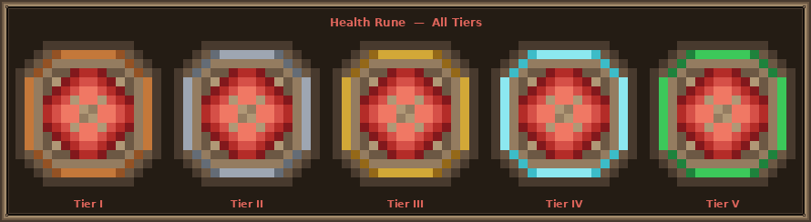

# Rune Module

> Adds a rune-based slot system that lets players permanently boost their stats.

## How it works

Rare **rune items** drop from the three vanilla bosses. Players open `/runes` to manage up to **5 rune slots** displayed as a hopper inventory. Placing a rune into a slot equips it; removing it returns the rune to the player's inventory. Modifiers take effect immediately on close and are restored on `login`.

Only one rune per family can be equipped at a time — equipping a higher-tier rune of the same family replaces the existing one.

| Detail           | Value                                        |
|------------------|----------------------------------------------|
| **Command**      | `/runes` (alias: `r`)                        |
| **Permission**   | `vanillaplus.rune` (default: true)           |
| **Slots**        | 5                                            |
| **Drop sources** | Elder Guardian, Wither, Warden, Ender Dragon |

## Runes

### Health Rune

Amethyst Shard. Grants bonus max health while equipped.

| Tier | Name            | Max Health Bonus |
|------|-----------------|------------------|
| I    | Health Rune I   | +8 ❤             |
| II   | Health Rune II  | +16 ❤            |
| III  | Health Rune III | +24 ❤            |
| IV   | Health Rune IV  | +32 ❤            |
| V    | Health Rune V   | +40 ❤            |



Only **Tier I** drops from bosses. Higher tiers are obtained by combining two runes of the same tier in an anvil (see below).

### Speed Rune

Feather. Grants bonus movement speed while equipped.

| Tier | Name           | Move Speed Bonus |
|------|----------------|------------------|
| I    | Speed Rune I   | +10% ⚡           |
| II   | Speed Rune II  | +20% ⚡           |
| III  | Speed Rune III | +30% ⚡           |
| IV   | Speed Rune IV  | +40% ⚡           |
| V    | Speed Rune V   | +50% ⚡           |


Only **Tier I** drops from bosses. Higher tiers are obtained via anvil combining.

## Anvil Combining

Place two identical runes in an anvil to produce the next tier. The XP cost scales with the tier:

```
cost = tier × anvilCombineCost
```

e.g. combining two Tier I runes costs `1 × 5 = 5` levels; combining two Tier IV runes costs `4 × 5 = 20` levels.

## Config

```kotlin
object Config {
    var dropChances: Map<EntityType, Double> = mapOf(
        EntityType.ELDER_GUARDIAN to 0.05,
        EntityType.WITHER to 0.10,
        EntityType.WARDEN to 0.15,
        EntityType.ENDER_DRAGON to 0.20,
    )
    var anvilCombineCost: Int = 5  // XP level multiplier per tier step
}
```

## Future Rune Ideas

1. **Attack Rune** — bonus attack damage per tier
2. **Defence Rune** — bonus armor per tier
3. **Depth Rune** — Elder Guardian drop; underwater breathing + mining speed
4. **Soul Rune** — Wither drop; bonus XP gain or undead damage resistance
5. **Void Rune** — Ender Dragon drop; ender pearl cooldown reduction
