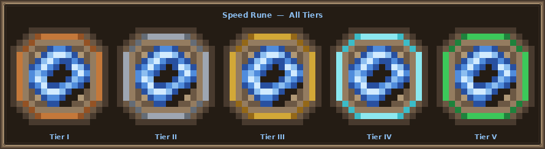

# Rune Module

> Adds a rune-based slot system that lets players permanently boost their stats.

## How it works

Rare **rune items** drop from the three vanilla bosses. Players open `/runes` to manage up to **5 rune slots** displayed as a hopper inventory. Placing a rune into a slot equips it; removing it returns the rune to the player's inventory. Modifiers take effect immediately on close and are restored on `login`.

Only one rune per family can be equipped at a time — equipping a higher-tier rune of the same family replaces the existing one.

| Detail           | Value                                        |
|------------------|----------------------------------------------|
| **Command**      | `/runes` (alias: `r`)                        |
| **Permission**   | `vanillaplus.rune` (default: true)           |
| **Slots**        | 5                                            |
| **Drop sources** | Elder Guardian, Wither, Warden, Ender Dragon |

## Runes

### Crimsonite Rune

Amethyst Shard. Grants bonus max health while equipped.

| Tier | Name           | Max Health Bonus |
|------|----------------|------------------|
| I    | Crimsonite I   | +8 ❤             |
| II   | Crimsonite II  | +16 ❤            |
| III  | Crimsonite III | +24 ❤            |
| IV   | Crimsonite IV  | +32 ❤            |
| V    | Crimsonite V   | +40 ❤            |


Only **Tier I** drops from bosses. Higher tiers are obtained by combining two runes of the same tier in an anvil (see below).

### Zephyrite Rune

Feather. Grants bonus movement speed while equipped.

| Tier | Name          | Move Speed Bonus |
|------|---------------|------------------|
| I    | Zephyrite I   | +10% ⚡           |
| II   | Zephyrite II  | +20% ⚡           |
| III  | Zephyrite III | +30% ⚡           |
| IV   | Zephyrite IV  | +40% ⚡           |
| V    | Zephyrite V   | +50% ⚡           |



Only **Tier I** drops from bosses. Higher tiers are obtained via anvil combining.

## Anvil Combining

Place two identical runes in an anvil to produce the next tier. The XP cost scales with the tier:

```
cost = tier × anvilCombineCost
```

e.g. combining two Tier I runes costs `1 × 5 = 5` levels; combining two Tier IV runes costs `4 × 5 = 20` levels.

## Config

```kotlin
object Config {
    // Each entry pairs an entity type with its drop chance and the runes that can drop.
    var dropTable: List<RuneDropTableData> = listOf(
        RuneDropTableData(EntityType.ELDER_GUARDIAN, 0.05, all),
        RuneDropTableData(EntityType.WITHER, 0.10, all),
        RuneDropTableData(EntityType.WARDEN, 0.15, all),
        RuneDropTableData(EntityType.ENDER_DRAGON, 0.20, all),
    )
    var anvilCombineCost: Int = 5  // XP level multiplier per tier step
}
```

## Future Rune Ideas

1. **Attack Rune** — bonus attack damage per tier
2. **Defence Rune** — bonus armor per tier
3. **Depth Rune** — Elder Guardian drop; underwater breathing + mining speed
4. **Soul Rune** — Wither drop; bonus XP gain or undead damage resistance
5. **Void Rune** — Ender Dragon drop; ender pearl cooldown reduction
