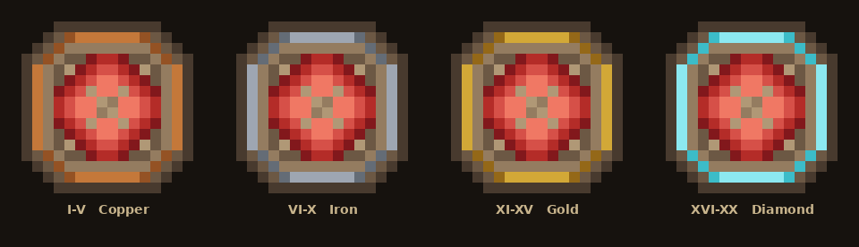

# Rune Module

> Adds a gem-based slot system that lets players permanently boost their stats.

## How it works

Rare **gem items** drop from the three vanilla bosses. Players open `/runes` to manage up to **5 rune slots** displayed as a hopper inventory. Placing a gem into a slot equips it; removing it returns the gem to the player's inventory. Modifiers take effect immediately on close and are restored on `login`.

Only one rune per family can be equipped at a time — equipping a higher-tier rune of the same family replaces the existing one.

| Detail           | Value                                |
|------------------|--------------------------------------|
| **Command**      | `/runes` (alias: `r`)                |
| **Permission**   | `vanillaplus.rune` (default: true)   |
| **Slots**        | 5                                    |
| **Drop sources** | Elder Guardian, Wither, Ender Dragon |

## Gems

### Health Rune

Amethyst Shard. Grants bonus max health while equipped.

| Tier | Name            | Max Health Bonus |
|------|-----------------|------------------|
| I    | Health Rune I   | +2 ❤             |
| II   | Health Rune II  | +4 ❤             |
| III  | Health Rune III | +6 ❤             |
| …    | …               | +2 per tier      |
| XX   | Health Rune XX  | +40 ❤            |



Only **Tier I** drops from bosses. Higher tiers are obtained by combining two runes of the same tier in an anvil (see below).

## Anvil Combining

Place two identical runes in an anvil to produce the next tier. The XP cost scales with the tier:

```
cost = tier × anvilCombineCost
```

e.g. combining two Tier I runes costs `1 × 5 = 5` levels; combining two Tier XIX runes costs `19 × 5 = 95` levels.

## Config

```kotlin
object Config {
    var runeDropChance: Double = 0.10  // 10 % chance per boss kill
    var anvilCombineCost: Int = 5      // XP level multiplier per tier step
}
```
